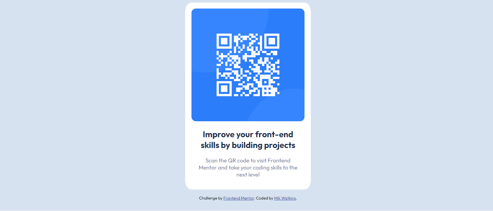

# Frontend Mentor - QR code component solution

This is a solution to the [QR code component challenge on Frontend Mentor](https://www.frontendmentor.io/challenges/qr-code-component-iux_sIO_H). Frontend Mentor challenges help you improve your coding skills by building realistic projects. 

## Table of contents

- [Overview](#overview)
  - [Screenshot](#screenshot)
  - [Links](#links)
- [My process](#my-process)
  - [Built with](#built-with)
  - [What I learned](#what-i-learned)
  - [Useful resources](#useful-resources)
- [Author](#author)

## Overview

### Screenshot

### Links

- Solution URL: [My solution URL](https://github.com/Mikerniker/Frontend-Mentor-Challenges/tree/main/Challenge1%20QR%20Code%20Component)
- Live Site: [My Site](https://63408701434e17007046575e--qrcodefrontendmentorpractice.netlify.app/)

## My process

### Built with

- HTML5 
- CSS custom properties
- CSS Box Model

### What I learned

**Box-Sizing**
> From this challenge, I learned about the box-sizing property, which lets us include the padding and border in an element's total width and height. This helped me form the box for the qr-code component.

**Centering**
> I also had to review how to center elements, which is a concept that still confuses me. But was able to achieve this by using text-align: center; in the body and using margin: auto for some of the elements that were not centered.

### Useful resources

- [Resource 1: w3schools](https://www.w3schools.com/css/css3_box-sizing.asp) - This helped me get a general understanding of box-sizing.
- [Resource 2: MDN Docs](https://developer.mozilla.org/en-US/docs/Web/CSS/box-sizing) - This also gave me additional insight on how to use box-sizing. I'm putting it here so I can review it again in the future.

## Author

- Website - [Mik Watkins](https://mikerniker.github.io/Project_Website/)
- Frontend Mentor - [@Mikerniker](https://www.frontendmentor.io/profile/Mikerniker)

## Acknowledgments

Angela Yu's course helped me through some concepts, which I reviewed to help me through this challenge. 

