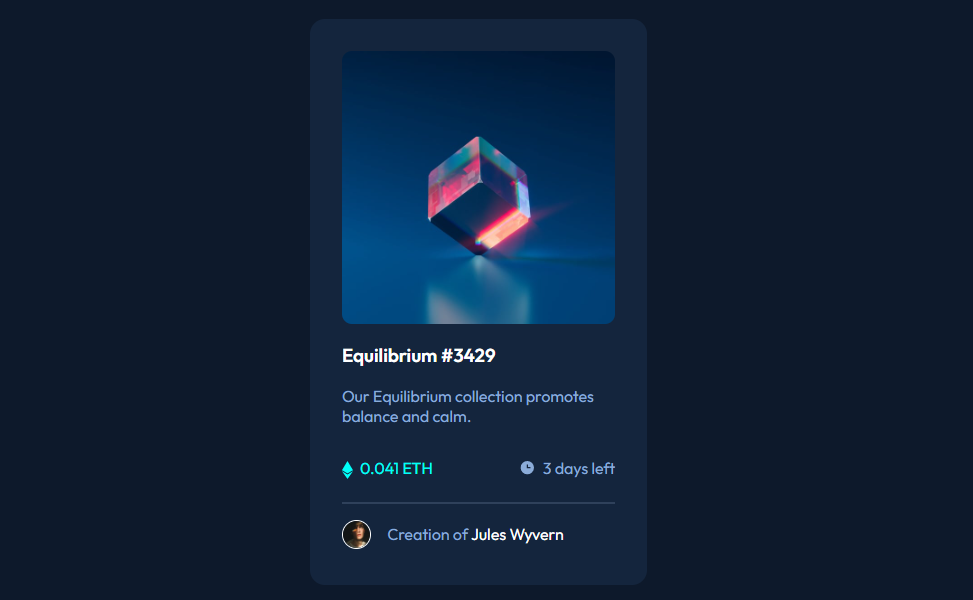
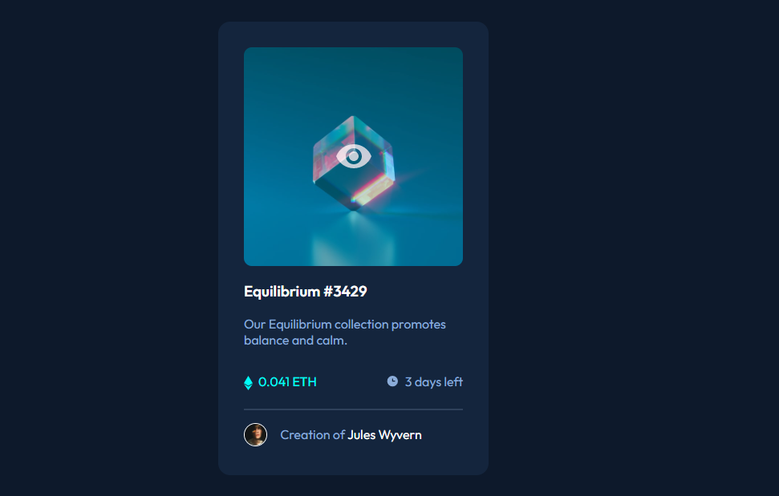

# Frontend Mentor - NFT preview card component solution

This is a solution to the [NFT preview card component challenge on Frontend Mentor](https://www.frontendmentor.io/challenges/nft-preview-card-component-SbdUL_w0U). Frontend Mentor challenges help you improve your coding skills by building realistic projects. 

## Table of contents

- [Overview](#overview)
  - [The challenge](#the-challenge)
  - [Screenshot](#screenshot)
  - [Links](#links)
- [My process](#my-process)
  - [Built with](#built-with)
  - [What I learned](#what-i-learned)
  - [Continued development](#continued-development)
  - [Useful resources](#useful-resources)
- [Author](#author)

## Overview

### The challenge

Users should be able to:

- See hover states for interactive elements

### Screenshot

- Active State:

### Links

- Solution URL: [Github Solution](https://github.com/Mikerniker/Frontend-Mentor-Challenges/tree/main/003%20NFT%20Preview%20Card)
- Live Site URL: [Live Site](https://fementor-nft-preview-card.netlify.app/)

## My process

### Built with

- Semantic HTML5 markup
- CSS custom properties
- Flexbox
- CSS Grid

### What I learned

- I had to review how to add an SVG as an  HTML <object> element and use width and height to specify the size of the SVG image.
  - Example: `<object data="./images/icon-ethereum.svg" width="30" height="30"> </object>`

- Learned How to add Image Overlay on Hover:
  - This was a useful resource that showed me how to do it: [Overlay Link](https://www.w3schools.com/HOWTO/howto_css_image_overlay_title.asp)
  - I'm not fully confident in using it, also I'm not clear on how to center the svg eye as an `<object>` element, but I changed it to an `<image>` element and centered it by using margin.

- Reviewed the difference between rgb vs hsl.
- How to make an image see-through on hover.

  ### Continued development

- For the eye overlay, I couldn't figure out how to align the svg in `<object>`, so I changed it to an `<image>` element and aligned it in the center by using margin-top.
- I still need to make it responsive for smaller devices. 

### Useful resources

- [Image Overlay on Hover]( https://www.w3schools.com/HOWTO/howto_css_image_overlay_title.asp) - This resource helped me learn how to add Image Overlay on Hover.

## Author

- Website - [Mik](https://mikerniker.github.io/Project_Website/)
- Frontend Mentor - [@Mikerniker](https://www.frontendmentor.io/profile/Mikerniker)
