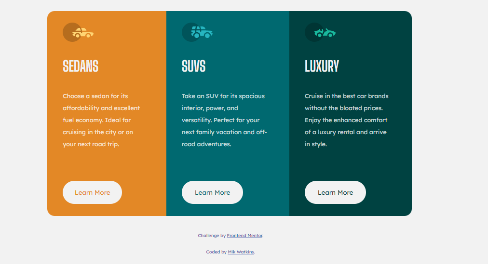

# Frontend Mentor - 3-column preview card component solution

This is my solution to the [3-column preview card component challenge on Frontend Mentor](https://www.frontendmentor.io/challenges/3column-preview-card-component-pH92eAR2-). 

## Table of contents

- [Overview](#overview)
  - [The challenge](#the-challenge)
  - [Screenshot](#screenshot)
  - [Links](#links)
- [My process](#my-process)
  - [Built with](#built-with)
  - [What I learned](#what-i-learned)
- [Author](#author)

## Overview

### The challenge

Users should be able to:

- View the optimal layout depending on their device's screen size
- See hover states for interactive elements

### Screenshot

### Links

- Solution URL: [Github Code](https://github.com/Mikerniker/Frontend-Mentor-Challenges/tree/main/006%20Three_Column_Preview_Card)
- Live Site URL: [Live Site](https://fementor3column-preview-card.netlify.app/)

## My process

### Built with

- Semantic HTML5 markup
- CSS custom properties
- Flexbox

### What I learned
- reviewed media queries

## Author

- Website - [Mik](https://mikerniker.github.io/Project_Website/)
- Frontend Mentor - [@Mikerniker](https://www.frontendmentor.io/profile/Mikerniker)

