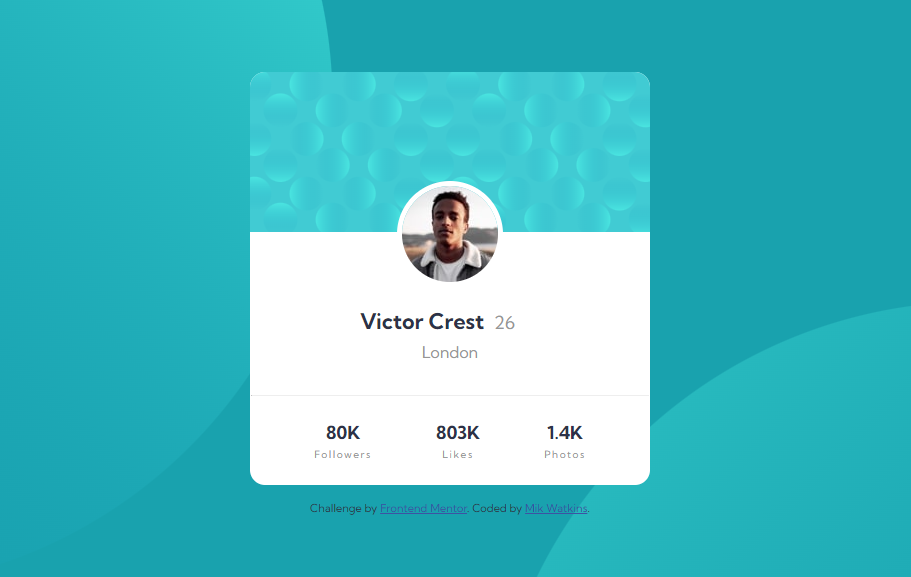

# Frontend Mentor - Profile Card Component Solution

This is a solution to the [Profile card component challenge on Frontend Mentor](https://www.frontendmentor.io/challenges/profile-card-component-cfArpWshJ). 

## Table of contents

- [Overview](#overview)
  - [The challenge](#the-challenge)
  - [Screenshot](#screenshot)
  - [Links](#links)
- [My process](#my-process)
  - [Built with](#built-with)
  - [What I learned](#what-i-learned)
  - [Useful resources](#useful-resources)
- [Author](#author)


## Overview

### The challenge

- Build out the project to the designs provided

### Screenshot




### Links

- Solution URL: [Github URL](https://github.com/Mikerniker/Frontend-Mentor-Challenges/tree/main/007%20Profile_Card_Component)
- Live Site URL: [Live Site](https://fementor-profile-card-solution.netlify.app/)

## My process

### Built with

- Semantic HTML5 markup
- CSS custom properties
- Flexbox


### What I learned

To remove the empty space left behind when using relative positioning, I had to add a negative margin-bottom, to the profile image
```
.profile-image {
    border-radius: 50%;
    border: 5px solid #FFFFFF;
    margin-bottom: -4.5rem;
    position: relative;
    bottom: 3.5rem;
}
```

### Useful resources

- [Background-position](https://developer.mozilla.org/en-US/docs/Web/CSS/background-position) - Learned about background-position, which sets the initial position for each background image.
- [CSS Multiple Backgrounds](https://www.w3schools.com/css/css3_backgrounds.asp) - Learned about adding multiple images to background


## Author

- Website - [Mik](https://mikerniker.github.io/Project_Website/)
- Frontend Mentor - [@Mikerniker](https://www.frontendmentor.io/profile/Mikerniker)
